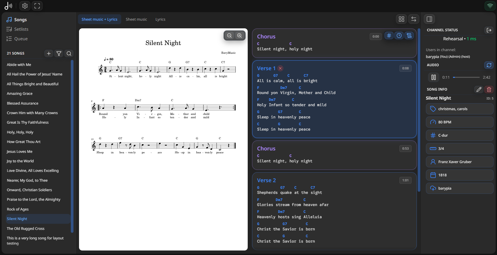
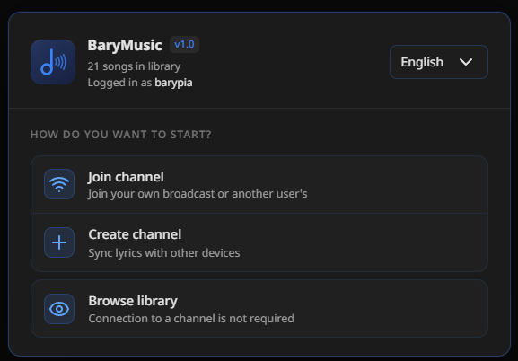
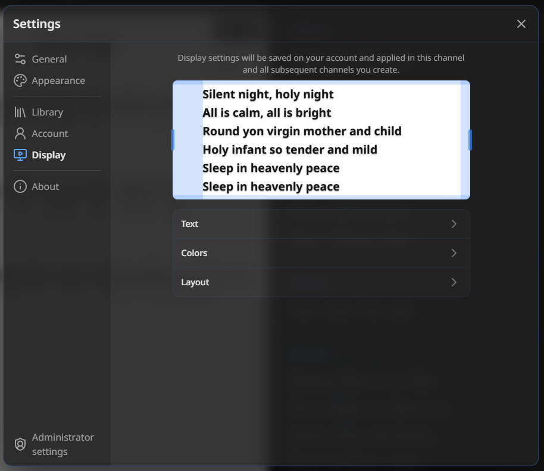
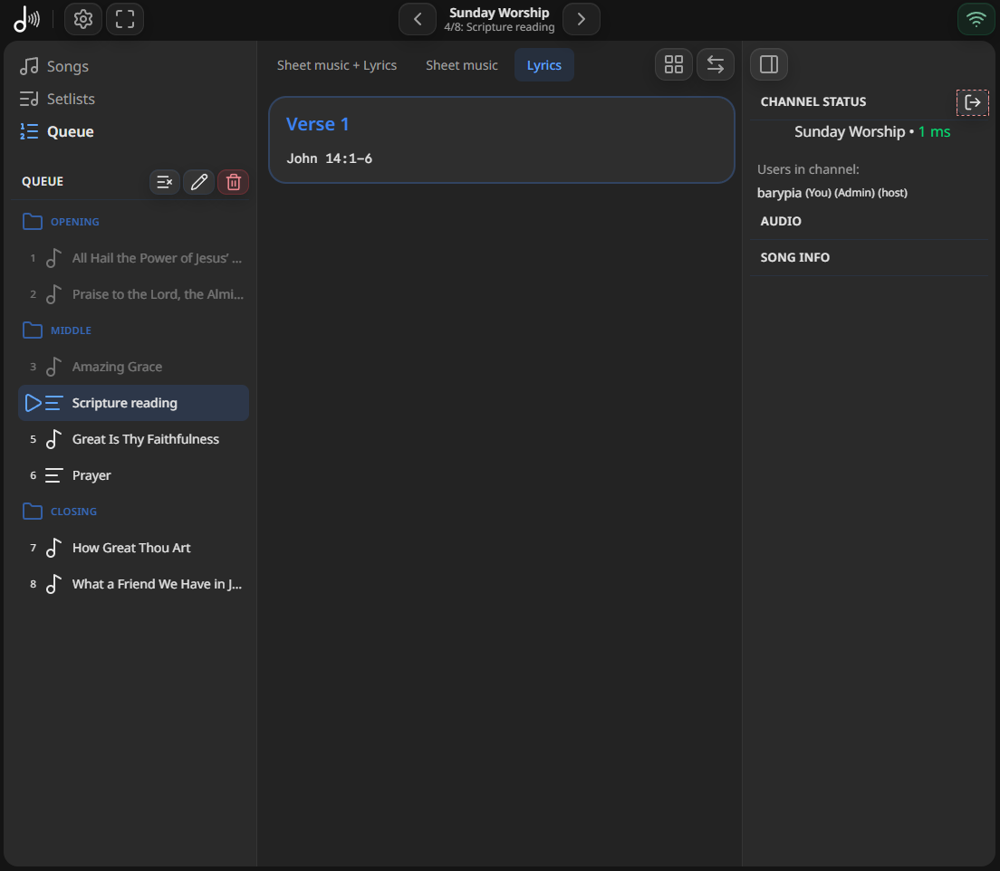
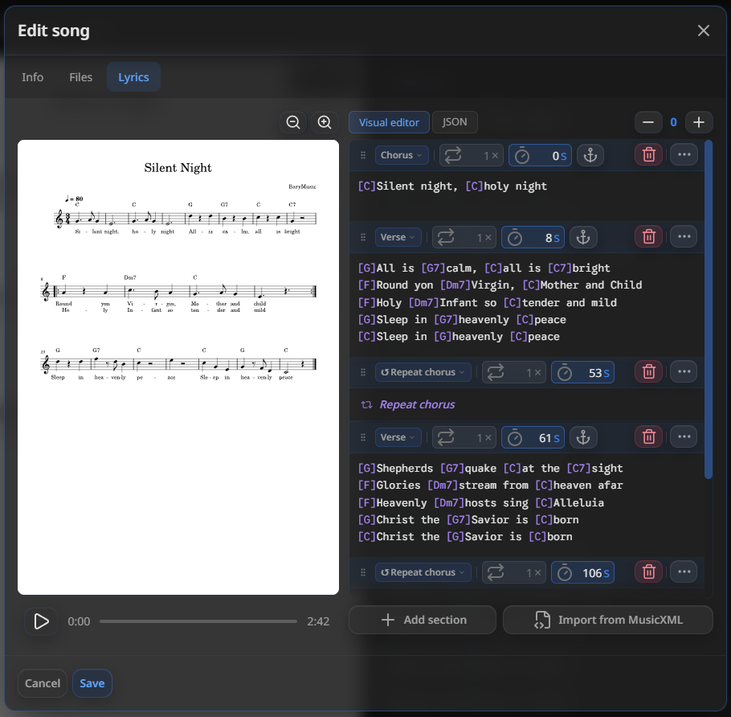

<div align="center">

  <div style="display: flex; align-items: center; justify-content: center;">
    
  </div>
  <h1>BaryMusic</h1>
  <p>
    <a href="#windows"></a>
    <a href="#docker"></a>
    <a href="LICENSE"></a>
    
  </p>
  <p align="center">Web app for managing songs, organizing setlists, and displaying live lyrics on external screens through a built-in channel system.</p>
  <p>
    <a href="#features">Features</a> ·
    <a href="https://github.com/barypia/barymusic/releases">Windows</a> ·
    <a href="https://hub.docker.com/repository/docker/barypia/barymusic/general">Docker</a> ·
    <a href="README_PL.md">Polski</a>
  </p>
</div>

---
## Screenshots
| Main interface (example for church use)| Connect screen |
| --- | --- |
|  |  |
| Display settings | Output view |
|  |  |
| Setlist and queue | Lyrics editor |
|  |  |
---
## Features
### Songs
- Add songs to the library easily
- Powerful search and filtering for your song library
- Add lyrics with sections and repeats
- Insert chords directly into lyrics
- Upload your own sheet music, with support for SVG files and raster formats
- Set a sheet position for each lyrics section
### Setlists
- Organize songs into setlists for live performances
- Group songs and text sections inside setlists
- Reorder items and build a running sequence for live use
### Channels
- Show lyrics on external screens in real time
- Connect presenters and viewers through a built-in channel system
- Sync display settings across connected devices
### Interface
- Easy-to-use interface designed for live work
- Fast navigation between songs, setlists and queue
- Use both a visual editor and a JSON editor for lyrics and setlists
### Multi-user support
- Support multiple users with individual accounts
- Keep songs and setlists public or private
- Control who can add or manage content
---
## Get started
### Windows

Download the `BaryMusic-1.0-windows-x64.zip` file from the [latest release](https://github.com/barypia/barymusic/releases), unpack it, then double-click `Start BaryMusic`.

Windows releases are built from this repository and published together with a SHA-256 checksum.

On first launch, choose a language and configure a few basic settings. You can change them at any time by double-clicking `Change Settings`.

App data is stored outside the unpacked application, in `%LOCALAPPDATA%\BaryMusic\`.
The launcher automatically creates the server configuration file at
`%LOCALAPPDATA%\BaryMusic\config\.env`. The launcher sets the listening address
and port according to the choices made during initial setup, so you do not need
to copy `server/.env.example` into the Windows release.
 
### Docker
 
The image is available on [Docker Hub](https://hub.docker.com/repository/docker/barypia/barymusic/general).  
  
Run BaryMusic with local access only: 
 
```bash
docker run \
  -p 127.0.0.1:3000:3000 \
  -v barymusic_data:/var/lib/barymusic \
  barypia/barymusic
```

To make it available to other devices on your local network:
```bash
docker run \
  -p 0.0.0.0:3000:3000 \
  -v barymusic_data:/var/lib/barymusic \
  barypia/barymusic
```

The container always listens on `0.0.0.0`. Local/LAN access is controlled by the host-side Docker port binding. LAN mode should only be used on a trusted network and may require allowing Docker through the host firewall. 

BaryMusic uses SQLite, so Docker and Kubernetes deployments should run as a single instance.

You can pass environment variables with `-e`, for example:

```bash
docker run \
  -p 127.0.0.1:3000:3000 \
  -v barymusic_data:/var/lib/barymusic \
  -e ALLOW_ALL_USERS_TO_ADD_SONGS=false \
  barypia/barymusic
```

Available environment variables:
 
| Variable                       | Default                 | Description                      |
| -                              | -                       | -                                |
| `ADMINS`                       | _(none)_                | Comma-separated list of admins                           |
| `CAN_ADD_SONGS`                | _(none)_ | Comma-separated list of users allowed to add songs besides admins |
| `ALLOW_ALL_USERS_TO_ADD_SONGS` | `true` | Allow all users to add songs |
| `ALLOW_REGISTRATION` | `true` | Allow new account registration |
| `CORS_ORIGIN`             | `http://localhost:3000` | Frontend URL for CORS                  |
| `HOST`                    | `127.0.0.1` (`0.0.0.0` in Docker) | Address the Node.js server listens on |
| `PORT`                    | `3000`                  | Service port  |
| `BARYMUSIC_HOME`          | _(unset)_               | Root containing `config`, `data`, and `logs`; set automatically in Docker and Windows releases |

In Docker, variables passed with `-e` or `--env-file` take precedence over values stored in `/var/lib/barymusic/config/.env`. Do not pass the local `server/.env` unchanged as a Docker `--env-file`: the container must listen on `HOST=0.0.0.0` for port mapping to work.

Set `BARYMUSIC_HOME` in the process environment before starting the application, not inside `.env`, because this variable determines the location of the `.env` file itself.

---

## Development
 
Requirements: **Node.js 22 or newer**
 
```bash
cd server
npm install
node barymusic.js
# Open http://localhost:3000
```
 
### Tailwind CLI
 
```bash
cd frontend
npx @tailwindcss/cli -i styles.css -o vendor/tailwind/tailwind.css --watch
```

App data is stored in the `server` directory.

For local configuration, copy the example file and adjust its values as needed:

```powershell
Copy-Item server/.env.example server/.env
```

On macOS or Linux, use `cp server/.env.example server/.env`. The local `.env` file is ignored by Git and should not be committed. Variables set directly in the process environment take precedence over values from this file.

To build the Windows release:

```powershell
.\scripts\build-windows-portable.ps1
```
---
 
### License
 
This project is licensed under **GPL-3.0**. See the [`LICENSE`](https://github.com/barypia/barymusic/blob/main/LICENSE) file for details.
